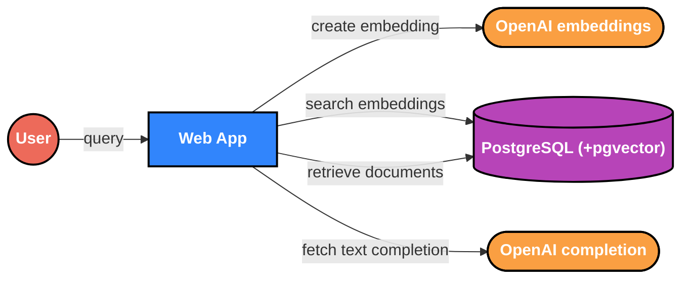
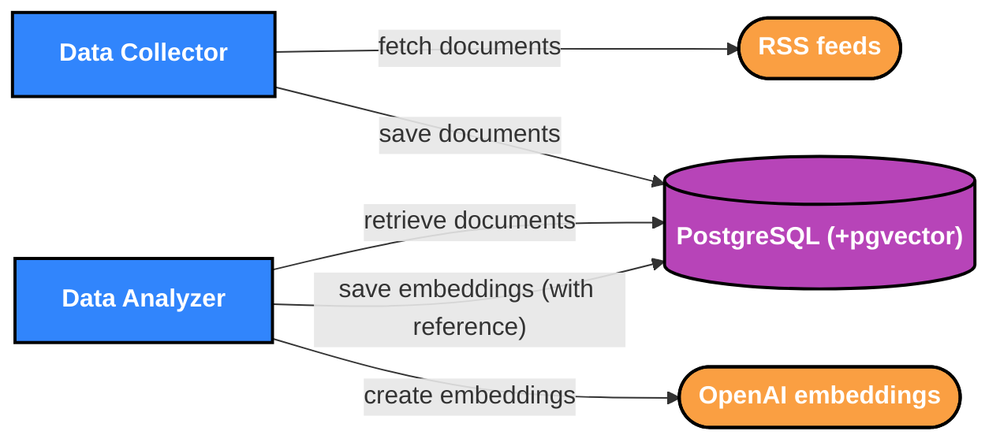

# Flask AI Starter

A starter application that shows a data collector architecture for [retrieval augmented generation](https://en.wikipedia.org/wiki/Prompt_engineering#Retrieval-augmented_generation).

## Technology stack

This codebase is written [Python](https://www.python.org/) and uses [Flask](https://flask.palletsprojects.com/) and
[Jinja2 Templates](https://jinja.palletsprojects.com/templates/) with the [OpenAI API](https://platform.openai.com/docs/overview).
It stores data in [PostgreSQL](https://www.postgresql.org/) and uses [pgvector](https://github.com/pgvector/pgvector) to
write and query embeddings.
A [GitHub Action](https://github.com/features/actions) runs tests.

## Architecture

The AI Starter consists of three free-running processes communicating with one Postgres database.

1.  The data collector is a background process that collects data from one or more sources.
1.  The data analyzer is another background process that processes collected data.
1.  The web application collects a query from the user and displays a result to the user.





### Collection and Analysis

The data collector fetches documents from RSS feeds sources and stores the document text in the database.
It also splits documents into chunks of less than 6000 tokens to ensure embedding and text completion calls stay below
their token limits.
The data analyzer sends document chunks to the [OpenAI Embeddings API](https://platform.openai.com/docs/guides/embeddings)
and uses pgvector to store the embeddings in PostgreSQL.

### Web Application

The web application collects the user's query and creates an embedding with the OpenAI Embeddings API.
It then searches the PostgreSQL for similar embeddings (using pgvector) and provides the corresponding chunk of text as
context for a query to the [OpenAI Chat Completion API](https://platform.openai.com/docs/api-reference/chat).

## Local development

1.  Install [uv](https://formulae.brew.sh/formula/uv), [PostgreSQL 17](https://formulae.brew.sh/formula/postgresql@17),
    and [pgvector](https://formulae.brew.sh/formula/pgvector).
    ```shell
    brew install uv postgresql@17 pgvector
    brew services run postgresql@17
    ```

1.  Set up environment variables.
    ```shell
    cp .env.example .env 
    source .env
    ```
1.  Set up the database.
    ```shell
    psql postgres < databases/create_databases.sql
    uv run alembic upgrade head
    DATABASE_URL="postgresql://localhost:5432/ai_starter_test?user=ai_starter&password=ai_starter" uv run alembic upgrade head
    ```
1.  Run tests.
    ```shell
    uv run -m unittest
    ```

1.  Run the collector and the analyzer to populate the database, then run the app and navigate to
    [localhost:5001](http://localhost:5001).

    ```shell
    uv run -m starter.collect
    uv run -m starter.analyze
    uv run -m starter
    ```

## Build container

1.  Build container
    ```shell
    uv pip compile pyproject.toml -o requirements.txt
    docker build -t flask-ai-starter .
    ```

1.  Run with docker
    ```shell
    docker run --env-file .env.docker flask-ai-starter  ./collect.sh
    docker run --env-file .env.docker flask-ai-starter  ./analyze.sh
    docker run -p 8081:8081 --env-file .env.docker flask-ai-starter
    ```   
