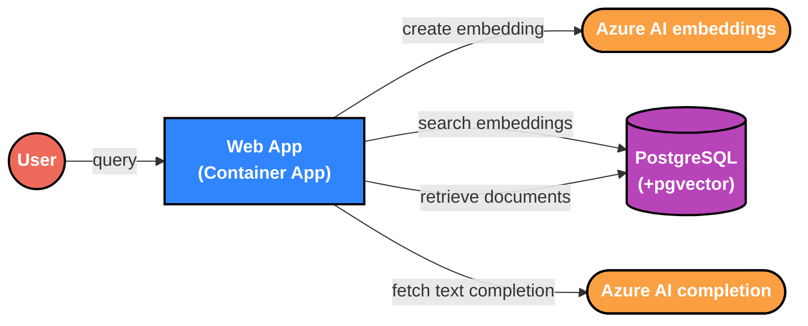
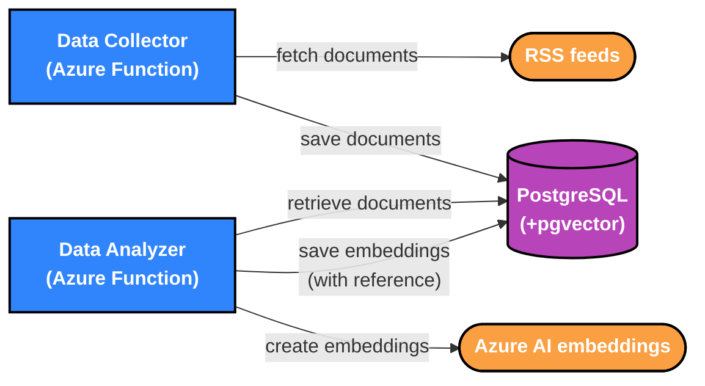

# Flask AI Starter

A starter application that shows a data collector architecture for [retrieval augmented generation](https://en.wikipedia.org/wiki/Prompt_engineering#Retrieval-augmented_generation).

## Technology stack

This codebase is written [Python](https://www.python.org/) and runs on Azure's [Container Apps](https://azure.microsoft.com/en-us/products/container-apps) and
[Functions](https://azure.microsoft.com/en-us/products/functions).
It uses [Flask](https://flask.palletsprojects.com/) and [Jinja2 Templates](https://jinja.palletsprojects.com/templates/)
with the [Azure OpenAI Service](https://learn.microsoft.com/en-us/azure/ai-services/openai/reference).
It stores data in [PostgreSQL](https://www.postgresql.org/) and uses [pgvector](https://github.com/pgvector/pgvector) to
write and query embeddings.
A [GitHub Action](https://github.com/features/actions) runs tests, builds the apps, runs migrations, then deploys to
Azure.

The [devcontainer.json](./.devcontainer/devcontainer.json) file configures an environment for local development in a
[Development Container](https://containers.dev/).

## Architecture

The AI Starter consists of three free-running processes communicating with one Postgres database.

1.  The data collector is a background process that collects data from one or more sources.
1.  The data analyzer is another background process that processes collected data.
1.  The web application collects a query from the user and displays a result to the user.





### Collection and Analysis

The data collector fetches documents from RSS feeds sources and stores the document text in the database.
It also splits documents into chunks of less than 6000 tokens to ensure embedding and text completion calls stay below
their token limits.
The data analyzer sends document chunks to the [Azure AI Embeddings API](https://learn.microsoft.com/en-us/azure/ai-services/openai/reference#embeddings)
and uses pgvector to store the embeddings in PostgreSQL.

### Web Application

The web application collects the user's query and creates an embedding with the OpenAI Embeddings API.
It then searches the PostgreSQL for similar embeddings (using pgvector) and provides the corresponding chunk of text as
context for a query to the [Azure AI Chat Completion API](https://learn.microsoft.com/en-us/azure/ai-services/openai/reference#completions).

## Local development

1.  Install and start [Docker Desktop](https://www.docker.com/products/docker-desktop/).
1.  Install and open [PyCharm](https://www.jetbrains.com/pycharm/).
1.  In the PyCharm menu, choose _File > Remote Development > Dev Containers > New Dev Containers > From VCS Project_,
    then enter `git@github.com:initialcapacity/flask-ai-starter.git` to [start the dev container](https://www.jetbrains.com/help/pycharm/connect-to-devcontainer.html#start_container_from_product)
    in PyCharm.
1.  Once your dev container is running, open a terminal in PyCharm (Alt/Option + F12) and run tests
    ```shell
    source venv/bin/activate
    python -m unittest
    ```

1.  Copy the example environment file and fill in the necessary values.
    ```shell
    cp .env.example .env 
    source .env
    ```

1.  Run the collector and the analyzer to populate the database, then run the app and navigate to
    [localhost:5001](http://localhost:5001).

    ```shell
    python collector.py
    python analyzer.py
    python -m starter
    ```
